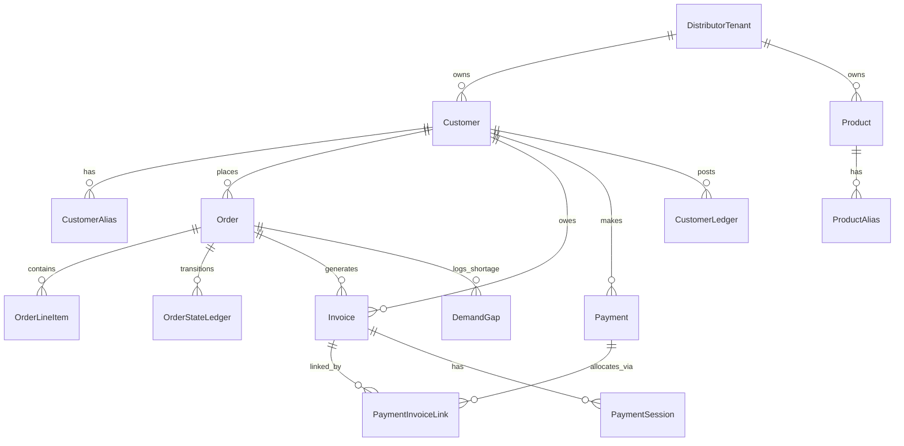

# DistributorOS Architecture Documentation

## 1. System Overview
DistributorOS is a WhatsApp-first B2B order management and payment collection platform designed for regional distributors. It ingests customer purchase intents from WhatsApp, matches raw order tokens to catalog products using Gemini LLM, manages inventory allocations and credit limit guardrails, and automates payment collections using Razorpay payment links and WhatsApp reminders.

### Technology Stack
- **Backend Framework:** FastAPI (Python)
- **Database:** PostgreSQL (Neon Serverless)
- **Frontend Framework:** Next.js (TypeScript, React, Tailwind CSS)
- **NLP & Parsing Engine:** Google Gemini (`gemini-2.5-flash` / `gemini-1.5-flash`)
- **WhatsApp Integration:** Evolution API v2.3.7
- **Payment Gateway:** Razorpay SDK (Link generation, callback webhook reconciliation)

### Infrastructure
- **Web App & Backend API:** Render Web Services
- **Evolution API Service:** Google Cloud Platform (GCP) Compute Engine VM (handles WhatsApp instance webhooks and media transport)
- **Primary Database:** Neon Serverless PostgreSQL instance

---

## 2. Key URLs
- **Backend URL:** `https://distributor-os-backend.onrender.com`
- **Frontend UI URL:** `https://distributor-os-ui.onrender.com`
- **Evolution API URL:** `http://34.158.60.42:8080`
- **Database:** Neon PostgreSQL Serverless Cloud

---

## 3. Core Data Models

- **DistributorTenant (`distributor_tenants`):** Represents the distributor business entity. Stores WhatsApp credentials (`whatsapp_phone_id`, `whatsapp_access_token`), plan metrics, and notification configuration preferences (`notification_prefs` JSONB). Also stores per-tenant Razorpay credentials: `razorpay_key_id`, `razorpay_key_secret_enc` (AES-256 encrypted), `razorpay_account_name`, and `razorpay_mode` (test/live auto-detected from key prefix).
- **Customer (`customers`):** B2B buyer profiles. Tracks `credit_limit`, `outstanding_balance`, payment terms (e.g. Net 15), addresses, and notification options.
- **CustomerAlias (`customer_aliases`):** Maps alternative names or WhatsApp phone numbers to a unique registered customer profile.
- **Product (`products`):** The distributor's stock catalog. Tracks price, SKU, brand, and pack size details.
- **ProductAlias (`product_aliases`):** Maps colloquial buyer shorthand terms to exact database product SKUs (e.g. "Liril 100g" -> SKU "LIR100").
- **Inventory (`inventory`):** Physical inventory counts. Separately tracks `quantity_on_hand` (actual physical stock) and `quantity_committed` (allocated to confirmed but not yet dispatched orders).
- **Order (`orders`):** Buyer order records. Tracks creation source (e.g., WhatsApp), invoice preference, and current status (`Draft`, `pending_review`, `Confirmed`, `Picked`, `Dispatched`, `Delivered`).
- **OrderLineItem (`order_line_items`):** Child items of an order. Tracks the requested quantity and the resolved `allocated_quantity` (supports partial allocation).
- **OrderStateLedger (`order_state_ledgers`):** Audit trail of state transitions for orders (e.g., from `Draft` to `Confirmed`).
- **Invoice (`invoices`):** Bill generated on order confirmation. Tracks `total_amount`, `amount_paid`, and `payment_status` (`UNPAID`, `PARTIALLY_PAID`, `PAID`).
- **Payment (`payments`) & PaymentInvoiceLink (`payment_invoice_links`):** Tracks transaction references, payment methods, amounts, and connects them to one or more paid invoices (implements FIFO payment cascade).
- **PaymentSession (`payment_sessions`):** active Razorpay checkout links, custom amounts, expiry dates, and link status.
- **CustomerLedger (`customer_ledger`):** Double-entry accounting tracking customer debits (invoices) and credits (payments).
- **DemandGap (`demand_gaps`):** Logs missed revenue caused by stock shortages (`STOCK_SHORTAGE`) or buyer credit limits (`CREDIT_LIMIT`).
- **WhatsappMessageLog (`whatsapp_message_logs`):** Logs all outgoing WhatsApp alerts and reminders to enforce frequency caps (e.g. max 1 reminder per customer every 3 days).
- **IngestionJob (`ingestion_jobs`):** Tracks bulk data imports (e.g. client listing or catalog Excel uploads).

### Model Relationships

---

## 4. Business Flows

### WhatsApp Order Ingestion Flow
1. **Webhook Reception:** Evolution API receives WhatsApp payload and POSTs to `/api/v1/whatsapp/webhook`.
2. **JID Validation (Layer 1):** Ignores broadcast lists or group chats; only processes individual chats (`@s.whatsapp.net`).
3. **Sender Isolation (Layer 2):** Drops self-messages originating from the distributor's own active number.
4. **Length Filter (Layer 3):** Drops trivially short messages (< 5 characters, e.g. "Ok").
5. **Gemini Flash Intent Gatekeeper (Layer 4):** Calls `gemini-2.5-flash` to verify purchase/inquiry intent. Fails open on LLM error.
6. **Customer Whitelist (Layer 5):** Rejects the message if the sender's phone cannot be resolved to a registered `Customer` or `CustomerAlias`.
7. **NLP Parsing:** Calls Gemini model to extract structured items and quantities from order text.
8. **Catalog Matcher:** Performs exact lookup, substring token matching, and RapidFuzz (threshold 82.0) fallback to map items to database products.
9. **Order Creation:** Generates a draft order. If any items are unmatched, the order is set to `pending_review`; otherwise, it's saved as `Draft`.
10. **Ingestion Alerts:** Sends a WhatsApp confirmation to the buyer and a new order alert to the distributor.

### Order Confirmation Flow
1. **Initiation:** Distributor clicks "Confirm" in dashboard, calling `/api/v1/orders/{order_id}/confirm`.
2. **Inventory Allocation:** Iterates line items. Allocates available stock (`quantity_on_hand`). Shortages are marked as open `DemandGap` entries of type `STOCK_SHORTAGE` (partial fills allowed).
3. **Stock Update:** For allocated units: decrements `quantity_on_hand` and increments `quantity_committed`.
4. **Credit Limit Check:** Compares the new billing total plus existing confirmed outstanding balances against the customer's credit limit. Exceeding it logs a `CREDIT_LIMIT` `DemandGap` and rolls back the transaction.
5. **Invoice Generation:** Creates an `Invoice` (status `UNPAID`) and a debit entry in `CustomerLedger`.
6. **Self-Learning Loop:** Analyzes newly matched product names and registers successful matches as new `ProductAlias` records for future automatic ingestion.
7. **State Transition:** Logs state transition to `Confirmed`.
8. **Notification:** Triggers the Evolution API to notify the customer of order confirmation with details of successfully allocated items.

### Payment Collections Flow
1. **Manual Collection Voucher:** Endpoint `/api/v1/payments/collect` allows manually registering a cash/check payment. Updates outstanding balances and runs FIFO cascade.
2. **Online Payment (Razorpay):** Links are fetched/generated using a Razorpay payment session.
3. **Webhook Reconciliation:** Razorpay callback to `/api/v1/payments/razorpay-webhook` triggers verification. If signature is verified, it registers the payment, decrements `outstanding_balance` on the `Customer`, and flushes.
4. **FIFO Allocation:** Automatically cascades payment amounts down unpaid or partially paid invoices starting with the oldest unpaid invoice first (unless a `preferred_invoice_id` is supplied to pay that specific invoice first).
5. **Payment Reminder Sweep:** The background scheduler or a POST to `/api/v1/payments/trigger-reminder-sweep` iterates active tenants:
    - Matches unpaid customer balances to aging tiers: `upcoming` (pre-due), `just_overdue` (0-7 days), `moderately_overdue` (8-21 days), or `severely_overdue` (22+ days).
   - Generates/fetches active Razorpay payment links for the most overdue invoice, and a consolidated payment link representing the customer's total outstanding balance.
   - Dispatches tiered WhatsApp reminders with payment checkout links (respecting the 3-day frequency cap).

### Notification Flow
- **Operational Notifications:** Whatsapp events mapped to order lifecycle steps: `order_received`, `order_confirmed`, `order_dispatched`, `order_delivered`, `new_order_alert_to_distributor`. Toggleable individually in tenant notification preferences.
- **Financial Notifications:** WhatsApp events mapped to collections: `payment_reminder_upcoming`, `payment_reminder_overdue`, `payment_received_confirmation`. 

---

## 5. Key Services

- **`notification_service.py`:** Renders template layouts and manages outgoing WhatsApp notification dispatches via Evolution API with fallback options.
- **`payment_reminder_service.py`:** Evaluates customer balances, maps aging reminder tiers, checks tenant preferences, and runs daily automated sweeps.
- **`payment_gateway.py`:** Manages SDK communication with Razorpay, handles link generation, callback checkouts, and verifies webhook signatures.
- **`payment_session_service.py`:** High-level wrapper to create, fetch, and expire customer checkout sessions for specific invoices or overall outstanding balances.
- **`ingestion_service.py`:** Orchestrates the 5-layer WhatsApp webhook filter, token extraction, and fuzzy product alias matching.
- **`order_confirmation_service.py`:** Manages order confirmations, credit guardrails, inventory adjustments, and invoice generations in a single atomic transaction.
- **`payment_service.py`:** Records manual collection vouchers and implements FIFO payment reconciliation logic with preferred invoice priority.

---

## 6. API Endpoints Reference

### `/api/v1/auth` (Authentication)
- `POST /firebase-login`: Authenticates Firebase JWT tokens and initializes session.
- `POST /signup`: Provisions new distributor tenant and primary user admin account.
- `POST /logout`: Clears backend session cookies.
- `GET /me`: Fetches profile details of current logged-in user.

### `/api/v1/tenant` (Tenant Integration & Settings)
- `PUT /profile`: Updates distributor tenant details.
- `GET /integrations/whatsapp`: Retrieves active Evolution API WhatsApp connection status.
- `PATCH /integrations/whatsapp`: Updates WhatsApp instance settings and phone IDs.
- `GET /notification-prefs`: Retrieves active notification preference flags.
- `PATCH /notification-prefs`: Saves updated operational/financial notification flags.
- `GET /razorpay-status`: Returns Razorpay connection status and masked key ID.
- `POST /razorpay-connect`: Validates and saves encrypted Razorpay credentials.
- `DELETE /razorpay-disconnect`: Clears Razorpay credentials.

### `/api/v1/customers` (Customer Directory)
- `GET /`: Lists all customer profiles.
- `POST /`: Creates a new customer profile.
- `PATCH /{customer_id}`: Updates customer credit limits, terms, or addresses.
- `GET /{customer_id}/statement`: Compiles PDF ledger statements.
- `PATCH /{customer_id}/notification-prefs`: Toggles notifications per customer.

### `/api/v1/products` (Catalog Management)
- `GET /`: Lists catalog items.
- `POST /`: Adds a new product to the catalog.
- `GET /inventory`: Retrieves active stock status.
- `POST /adjust-stock`: Registers manual stock counts or updates.
- `POST /import`: Bulk imports products from CSV/XLSX.

### `/api/v1/orders` (Order Management)
- `GET /`: Retrieves order list with amounts computed from allocated items.
- `POST /`: Creates a new manual order.
- `POST /create`: Direct endpoint for manual order placement.
- `GET /{order_id}`: Fetches detailed line item info showing requested vs allocated counts.
- `PATCH /{order_id}`: Edits quantities or updates line items.
- `GET /{order_id}/invoice`: Generates invoice PDFs.
- `PUT /{order_id}/status`: Transitions order state manually.
- `POST /{order_id}/confirm`: Runs confirmation checks, credit limits, and allocates stock.
- `POST /{order_id}/batch-confirm`: Fast order confirmation from the orders page drawer.
- `POST /{order_id}/dispatch`: Transitions order status to Dispatched and schedules delivery.
- `POST /{order_id}/delivery-event`: Registers physical delivery events.
- `GET /{order_id}/risk-assessment`: Evaluates credit and fraud indicators.
- `PATCH /items/{item_id}/resolve`: Manually matches an unmatched item from `pending_review`.
- `POST /bulk-action`: Enqueues bulk confirmations or status updates.
- `GET /bulk-action/{job_id}`: Status of bulk update background tasks.

### `/api/v1/payments` (Collections & Invoices)
- `POST /collection-voucher`: Creates a payment voucher.
- `POST /voucher`: Registers a manual check/cash collection.
- `POST /collect`: Processes manual collection and runs FIFO cascade.
- `GET /payment-link`: Generates interactive Razorpay links.
- `GET /payment-options`: Fetches client integration keys.
- `POST /razorpay-webhook`: Verifies signature and executes online payment reconciliation.
- `POST /trigger-reminder-sweep`: Manually fires the daily payment reminder sweep.

### `/api/v1/shipments` (Logistics)
- `GET /pending`: Lists orders awaiting dispatch.
- `GET /active`: Lists active shipments in transit.
- `POST /`: Books carrier waybills (mock integration with Bluedart/Delhivery).
- `PATCH /{shipment_id}/status`: Updates shipping checkpoints.

### `/api/v1/dashboard` (Analytics & Cards)
- `GET /overview`: Returns high-level metrics for dashboard cards.
- `GET /metrics`: Returns charts for sales and collections.
- `GET /recent-orders`: Populates dashboard activity feed.
- `GET /collections-donut`: Breakdown of outstanding vs collected receivables.
- `GET /demand-gap-summary`: Summarizes lost revenue from stock shortages or credit limits.

### `/api/v1/whatsapp` (WhatsApp Integration Webhooks)
- `GET /webhook`: Meta verification endpoint (legacy).
- `POST /webhook`: Handles incoming WhatsApp messages from Evolution API.
- `POST /provision`: Instantiates new WhatsApp API credentials.

---

## 7. Environment Variables

- `DATABASE_URL`: Connection string for primary database.
- `GEMINI_API_KEY`: API key for Google Gemini model.
- `EVOLUTION_API_URL`: Root URL of Evolution API instance (GCP VM).
- `EVOLUTION_API_KEY`: Evolution API instance master key.
- `RAZORPAY_KEY_ID`: Razorpay credentials key identifier. *(Deprecated — replaced by per-tenant credentials stored in DB)*
- `RAZORPAY_KEY_SECRET`: Razorpay credentials private key. *(Deprecated — replaced by per-tenant credentials stored in DB)*
- `ENCRYPTION_KEY`: Fernet AES-256 key for encrypting per-tenant Razorpay secrets.
- `RAZORPAY_WEBHOOK_SECRET`: Secret token verifying Razorpay webhook callbacks.
- `ALLOWED_ORIGINS`: Allowed origins list for CORS headers.
- `FIREBASE_CREDENTIALS_JSON` / `FIREBASE_CREDENTIALS_PATH`: Paths to credentials JSON mapping for user authentication.
- `APP_URL` / `RENDER_EXTERNAL_URL`: Base application URL.
- `SEED_DEMO_DATA`: Boolean to seed test metrics on startup.
- `ENABLE_PAYMENT_REMINDER_SCHEDULER`: Boolean to toggle background reminder sweep cron.
- `DB_POOL_SIZE` / `DB_MAX_OVERFLOW` / `DB_POOL_TIMEOUT`: Connection pool properties.

---

## 8. Known Design Decisions

- **Inventory Allocation Point:** Inventory is allocated and deducted upon order **confirmation**, not dispatch. The flag `INVENTORY_DEDUCTION_TRIGGER` in `orders.py` defines this behavior.
- **Stock Tracking:** Separates physical stock (`quantity_on_hand` is decremented on confirmation) and allocated stock (`quantity_committed` is incremented on confirmation).
- **Inventory Restoration:** The utility `restore_inventory_for_order()` is defined in `orders.py` but is not invoked in the primary flows. It is intended for a future order cancel/reject feature.
- **Credit Limit Guardrails:** Exceeding credit limits logs a `CREDIT_LIMIT` gap in `DemandGap` and aborts confirmation immediately via transaction rollback.
- **FIFO Allocation Priority:** Reconciliations apply incoming collections to the oldest unpaid invoice first, unless `preferred_invoice_id` is supplied to prioritize a specific invoice.
- **Order Triage Statuses:** Draft orders parsed from WhatsApp webhook that contain unmatched line items default to `pending_review` (not `NEEDS_REVIEW`) to indicate they need manual resolution.
- **Evolution API JID resolution:** Evolution API v2.3.7 running on a GCP VM handles incoming JIDs and correctly resolves `@lid` (WhatsApp identity) values to real phone numbers.

---

## 9. Current Bugs / Known Issues

- **SQLite Limitations:** Local test environments use SQLite memory mappings. Since SQLite lacks Postgres native JSONB querying, fields like `notification_prefs` utilize SQLAlchemy's `with_variant(JSON(), "sqlite")` fallback, which may exhibit minor query performance differences compared to production.
- **Razorpay Session State Consistency:** If a Razorpay payment link expires, there is no direct hook to immediately restore/update link statuses in the database; link state is verified and resolved during webhook ingestion or subsequent sweeps.
- **No Order Rejection Inventory Hook:** Cancelling a confirmed order does not automatically run `restore_inventory_for_order()`, requiring manual stock adjustments to revert the committed inventory count.
- **Evolution API Network Retries:** Evolution API webhooks are dispatched asynchronously; network delays on Render sleep states may lead to ingestion delays or message deduplication retries.
- **Zero-value invoices:** Orders confirmed with 0 allocated units still create invoices with `total_amount = 0.00`. These are excluded from payment reminder sweeps via `total_amount > 0` filter but remain in the DB.
